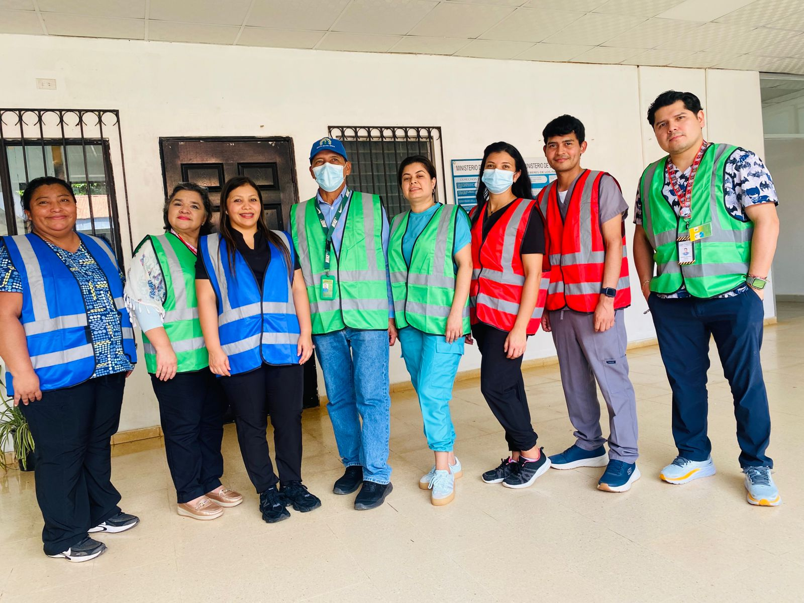
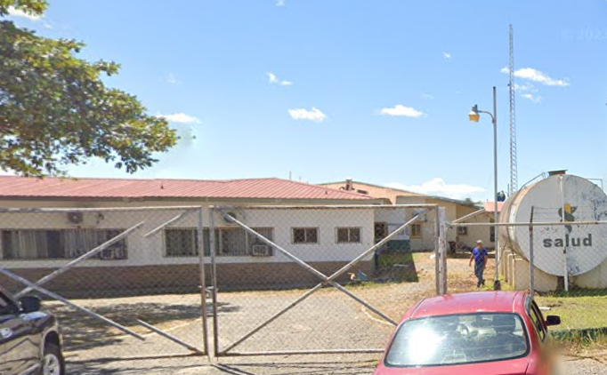

index.html
<!DOCTYPE html>
<html lang="es">
<head>
  <meta charset="UTF-8">
  <meta name="viewport" content="width=device-width, initial-scale=1.0">
  <title>Hospital General del Oriente Chiricano Dr. Francisco Pérez</title>
  
</head>
<body>
<header style="background-image:url('banner.jpg'); background-size:cover; background-position:center; color:white; padding:100px 20px;">
  <h1 style="background-color:rgba(0,0,0,0.5); display:inline-block; padding:20px; border-radius:10px;">
    Hospital General del Oriente Chiricano Dr. Francisco Pérez
  </h1>
  

    Comprometidos con la salud y el bienestar de nuestra comunidad
  

</header>

  <nav>
    <a href="#inicio">Inicio</a>
    <a href="#buzones">Buzones</a>
    <a href="#conferencias">Conferencias</a>
    <a href="#talleres">Talleres</a>
    <a href="#mapa">Mapa</a>
    <a href="#contacto">Contacto</a>
  </nav>

  <section id="inicio" class="hero">
    <h1>Bienvenidos al Hospital General del Oriente Chiricano</h1>
    
Brindamos atención médica integral y servicios de calidad a toda la región oriental de Chiriquí.

    

      
      
    

  </section>

  <section id="buzones">
    <h2>Buzones de Sugerencias</h2>
    
En el Hospital contamos con buzones físicos y virtuales para recibir sus comentarios y sugerencias.

    <form>
      <label for="nombre">Nombre:</label>
      <input type="text" id="nombre" name="nombre" placeholder="Tu nombre...">

      <label for="correo">Correo electrónico:</label>
      <input type="email" id="correo" name="correo" placeholder="tu@correo.com">

      <label for="mensaje">Mensaje o sugerencia:</label>
      <textarea id="mensaje" name="mensaje" rows="4" placeholder="Escribe aquí tu mensaje..."></textarea>

      <button type="submit">Enviar</button>
    </form>
  </section>

  <section id="conferencias">
    <h2>Conferencias</h2>
    
El hospital realiza conferencias educativas dirigidas al personal de salud y la comunidad.

    
Próximas conferencias se anunciarán en nuestras redes y carteleras institucionales.

  </section>

  <section id="talleres">
    <h2>Talleres y Capacitaciones</h2>
    
Fomentamos la formación continua del personal mediante talleres prácticos y programas de actualización.

    
Temas recientes incluyen salud cardiovascular, emergencias médicas y gestión de calidad hospitalaria.

  </section>

  <section id="mapa">
    <h2>Ubicación</h2>
    
Encuéntranos fácilmente a través de Google Maps:

    <iframe 
      src="https://www.google.com/maps/embed?pb=!1m18!1m12!1m3!1d3923.3421395928473!2d-82.59626722529126!3d8.352833991728891!2m3!1f0!2f0!3f0!3m2!1i1024!2i768!4f13.1!3m3!1m2!1s0x8fa5f3a82b28b68b%3A0x356d25e5021c9c78!2sHospital%20General%20del%20Oriente%20Chiriqu%C3%A1no%20Dr.%20Francisco%20P%C3%A9rez!5e0!3m2!1ses!2spa!4v1700000000000!5m2!1ses!2spa"
      allowfullscreen=""
      loading="lazy">
    </iframe>
  </section>

  <section id="contacto">
    <h2>Contacto</h2>
    
<strong>Dirección:</strong> Oriente de Chiriquí, Panamá

    
<strong>Teléfono:</strong> (000) 000-0000

    
<strong>Email:</strong> hospitaloriente@minsa.gob.pa

  </sec
